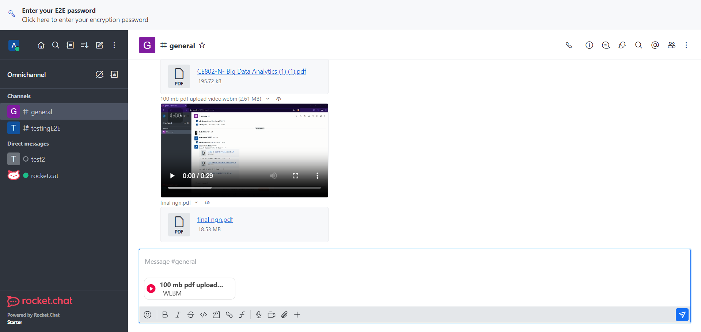
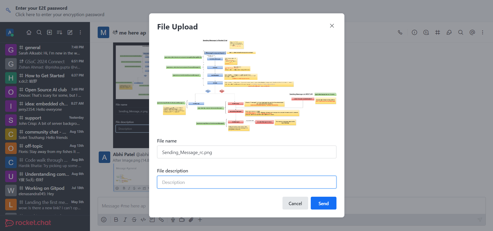
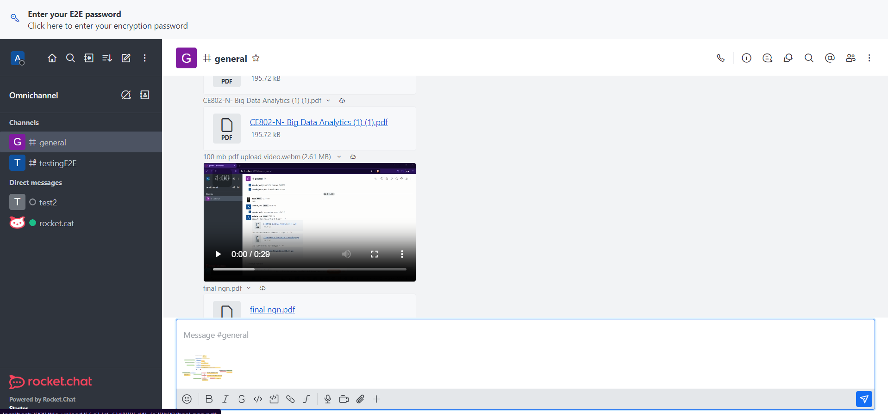
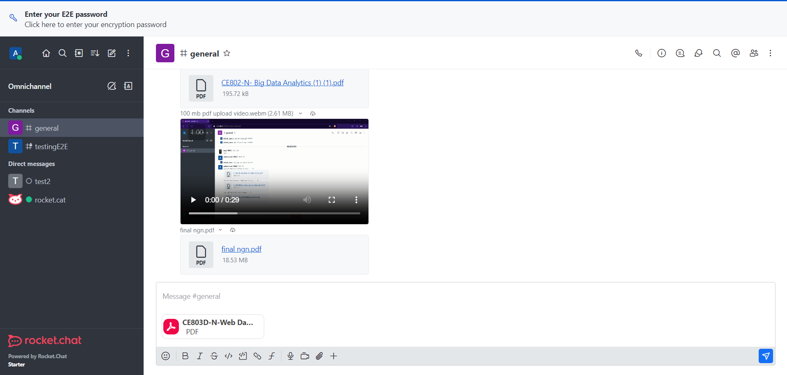

    
     
    <b> 
        

        Project Name  :- Multiple file sharing in one message  
        Organizations :- <a href="https://rocket.chat/">Rocket.Chat</a>
        

        

    </b>

 
 

<code> <a href="#-project-abstract">Project Abstract</a>&nbsp;&nbsp;&nbsp; <a href="#-deliverables">Deliverables</a>&nbsp;&nbsp;&nbsp; <a href="#-demo">Demo</a>&nbsp;&nbsp;&nbsp; <a href="#-contributions">Contributions</a>&nbsp;&nbsp;&nbsp; <a href="#-mentors">Mentors</a>
</code>

 
 

## ⭐ Project Abstract

The goal of this project is to enable the sharing of multiple files in a single message within Rocket.Chat. Currently, the platform only allows users to share one file at a time, which is a significant limitation for many users. Addressing this issue is crucial to meeting user needs and enhancing the overall functionality of the platform.

## 🚢 Deliverables

The following are the deliverables of this project:

- The user can share the multiple files at a time.
- Users can tag another user and can also use all the functionality of the messageBox.
- Users can now send the message while typing in the messagebox.
- Users can get the notification when selecting the files with more size while selecting.
- If selected file size is more than the admin's prescribed so it will show the Toast Message.
- Updated the UI of the files to be shared.

## 📺 Product Demo:-

- Video Sharing :-

  - Before 

  - After 

- Image Sharing :-

  - Before 

  - After 

- PDF Sharing :-

  - Before 

  - After 

- Adding and Removing of files :- -

https://github.com/user-attachments/assets/4dd63f0b-f2fe-4612-8402-3c6bb74baeab

## 🚀 Contributions

### PR

feat: Multiple file sharing in one message :- [#32703](https://github.com/RocketChat/Rocket.Chat/pull/32703/)

### Future Scope

I will be resolving the bugs and also will work on the changes as per the requirements of the project. Finally I'll be coordinating with the team to release this feature as the first version of multiple file sharing in one message in the Rocket.Chat's release cycle.

## 🎓 Mentors

I'm incredibly grateful to my mentors for their guidance and support before and throughout GSoC. 🙏

I’ve learned so much, not just within GSoC but far beyond, and I’m truly thankful to have had the opportunity to be mentored by such amazing people.

- **Dhruv Jain** - [GitHub](https://github.com/dhruvjain99). [LinkedIn](https://www.linkedin.com/in/dhruvjain99/)

- **Rodrigo Nascimento** - [GitHub](https://github.com/rodrigok). [LinkedIn](https://www.linkedin.com/in/rodrigoknascimento/)

## 💬 Contact Me

| **Student**      | Abhi Patel                                                                                                  |
| :--------------- | :---------------------------------------------------------------------------------------------------------- |
| **Organization** | [Rocket.Chat](https://rocket.chat/)                                                                         |
| **Project**      | [Multiple file sharing in one message](https://summerofcode.withgoogle.com/programs/2024/projects/0Owzlw7n) |
| **GitHub**       | [@abhipatel0211](https://github.com/abhipatel0211)                                                          |
| **LinkedIn**     | [abhipatel](https://www.linkedin.com/in/abhi-patel-13354013b/)                                              |
| **Website**      | [bit.ly/abhi-patel](http://bit.ly/abhi-patel)                                                               |
| **Email**        | <a href="mailto:abhiptl0123@gmail.com">abhiptl0123@gmail.com</a>                                            |
| **Rocket.Chat**  | [abhi.patel](https://open.rocket.chat/direct/abhi.patel)                                                    |
